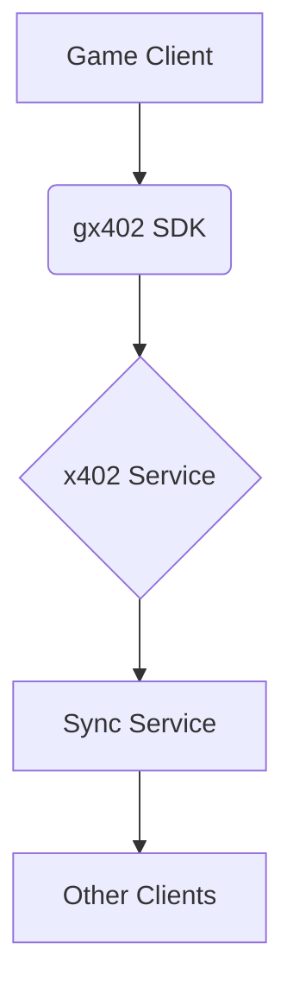

# Images and Media

Learn how to effectively include images and media in your gx402 SDK documentation to enhance understanding and provide visual context.

## Image Usage Best Practices

### When to Use Images

#### Good Use Cases
- **Architecture diagrams**: Show system architecture or data flow
- **Screenshot examples**: UI elements, dashboard views, or configuration screens
- **Code execution results**: Visual output of code examples
- **Platform interfaces**: UI differences between platforms
- **Error states**: Visual representation of error conditions
- **Process flows**: Step-by-step visual guides

#### Avoid Overusing Images
- Don't use images for simple code examples (use code blocks instead)
- Avoid decorative images that don't add value
- Don't use images for text that could be searched/indexed

### Image Formats and Optimization

#### Recommended Formats
- **PNG**: Best for screenshots, UI elements, diagrams with transparency
- **JPEG**: Good for photographs, complex images with many colors
- **SVG**: Ideal for simple diagrams, icons, and logos
- **WebP**: Modern, optimized format when browser support allows

#### File Size Optimization
```bash
# Optimize PNG images
optipng image.png

# Optimize JPEG images
jpegoptim image.jpg

# Convert and optimize to WebP
cwebp image.png -o image.webp
```

## Adding Images to Documentation

### Basic Image Syntax
```md


<!-- Example: -->

```

### Responsive Images
Images are automatically responsive in Mintlify:

```md

```

### Images with Custom Styling
```md

```

## Image Organization

### Directory Structure
```
images/
├── architecture/          # System architecture diagrams
│   ├── data-flow.png
│   └── sync-architecture.png
├── platform-screenshots/  # Platform-specific UI
│   ├── unity-setup.png
│   ├── unreal-plugin.png
│   └── mobile-permissions.png
├── code-examples/        # Visual code results
│   ├── sync-result.png
│   └── error-output.png
├── guides/               # Tutorial screenshots
│   ├── quickstart-step1.png
│   └── dashboard-view.png
└── logos/                # Brand and platform logos
    ├── unity-logo.svg
    └── discord-logo.png
```

## Image Components in MDX

### Using the Frame Component
The `Frame` component provides styling for images:

```md
<Frame>
  
</Frame>
```

### Side-by-Side Images
```md
<Columns cols={2}>
<div>


</div>
<div>


</div>
</Columns>
```

## Creating Effective Technical Images

### Architecture Diagrams

#### Simple Diagram Example
Create diagrams using tools like:
- [Mermaid](https://mermaid.js.org/) (if supported)
- [Draw.io](https://draw.io)
- [Lucidchart](https://lucidchart.com)
- [Figma](https://figma.com)



#### Multi-Platform Architecture


### Screenshot Guidelines

#### Before Taking Screenshots
- Clear desktop/applications of unnecessary elements
- Use consistent window sizes and positions
- Ensure UI elements are clearly visible
- Include relevant context

#### Good Screenshot Example
```md
## Unity Setup

1. Open Package Manager (Window > Package Manager)
2. Click the + button and select "Add package from git URL"

<Frame>
  
</Frame>

3. Enter the gx402 SDK URL: `https://github.com/gx402/unity-sdk.git`
```

### Diagram Types for Documentation

#### 1. Data Flow Diagrams
Show how data moves through the system:

<Frame>
  
</Frame>

#### 2. Platform Comparison Charts
Visualize feature differences between platforms:

<Frame>
  
</Frame>

#### 3. Error State Visuals
Show what different error states look like:

<Frame>
  
</Frame>

## Video and Animated Content

### GIF Usage
For short, looping processes:

```md

```

### Video Integration
When supported, use videos for complex processes:

```md
<video 
  controls 
  width="100%" 
  poster="/images/video-preview.png"
  style={{ borderRadius: '0.5rem' }}
>
  <source src="/videos/unity-setup.mp4" type="video/mp4" />
  <source src="/videos/unity-setup.webm" type="video/webm" />
  Your browser does not support the video tag.
</video>
```

## Best Practices for Accessibility

### Alt Text Guidelines
- Describe the content and function of the image
- Be concise but informative
- Don't start with "Image of..." or "Screenshot of..."
- Include important text that appears in the image

```md
<!-- Good alt text -->
![Gx402 SDK configuration panel with API key field highlighted]

<!-- Avoid -->
![Screenshot of configuration]
```

### Color Considerations
- Ensure good contrast for accessibility
- Don't rely solely on color to convey information
- Test with color-blindness simulators

## Platform-Specific Image Examples

### Unity Integration Images
```md
<Frame>
  
</Frame>
```

### Code Example Visuals
For complex code concepts:

<Frame>
  
</Frame>

## Image Optimization Techniques

### Compression Tools

#### Command-line tools
```bash
# Install optimization tools
npm install -g imagemin-cli

# Optimize images
imagemin input/*.png --out-dir=output/

# Convert to WebP
imagemin input/*.png --plugin=webp --out-dir=output/
```

#### Online tools
- [TinyPNG](https://tinypng.com/) - PNG/JPEG optimization
- [Squoosh](https://squoosh.app/) - Web-based image optimization
- [CloudConvert](https://cloudconvert.com/) - Format conversion

### Image Dimensions
- **Screenshots**: Use actual size or scale to 800-1200px width
- **Diagrams**: Ensure text remains readable (minimum 12px font equivalent)
- **Icons**: Use vector formats (SVG) when possible

## Image Hosting and Management

### Local Images
Store images in the `/images` directory relative to your docs root:
```
docs/
├── index.mdx
├── images/
│   ├── sdk-logo.png
│   └── architecture/
│       └── flow.png
```

### Image References
Use relative paths from the docs root:
```md

```

## Common Image Use Cases in gx402 Docs

### 1. SDK Installation Screenshots
```md
## Installation

### Unity Package Manager
Open the Package Manager and add the gx402 SDK:

<Frame>
  
</Frame>
```

### 2. Dashboard Screenshots
```md
## Getting Your API Key

1. Log in to your [gx402 Dashboard](https://gx402.com/dashboard)
2. Create a new project
3. Copy your API key from the project settings:

<Frame>
  
</Frame>
```

### 3. Error Visualization
```md
<Frame>
  
</Frame>

<Note>
If you see this error, verify your API key is correctly formatted and active.
</Note>
```

## Tools for Creating Documentation Images

### Diagram Tools
- **Draw.io**: Free, web-based diagramming
- **Lucidchart**: Collaborative diagramming
- **Figma**: Modern design tool with good export options
- **PlantUML**: Text-based diagramming
- **Mermaid**: Markdown-integrated diagrams

### Screen Capture Tools
- **Built-in tools**: Snipping Tool (Windows), Grab (macOS), Screenshot (Linux)
- **Enhanced tools**: ShareX (Windows), Skitch (macOS), Flameshot (Linux)
- **Recording**: OBS Studio, QuickTime Player, ScreenToGif

### Image Editing
- **GIMP**: Free, powerful image editor
- **Photoshop**: Professional editing
- **Canva**: Quick, web-based editing
- **Figma**: Vector and raster editing

## Image Maintenance

### Regular Review
- Check for outdated UI elements in screenshots
- Verify all images load properly
- Update diagrams when architecture changes
- Remove unused images to reduce bundle size

### Version Control
- Store original, high-resolution images separately if needed
- Commit optimized versions to the repository
- Use descriptive filenames that indicate content and date if versioned

Images significantly enhance documentation by providing visual context and making complex concepts more understandable. Use them strategically to support your written content, not replace it.